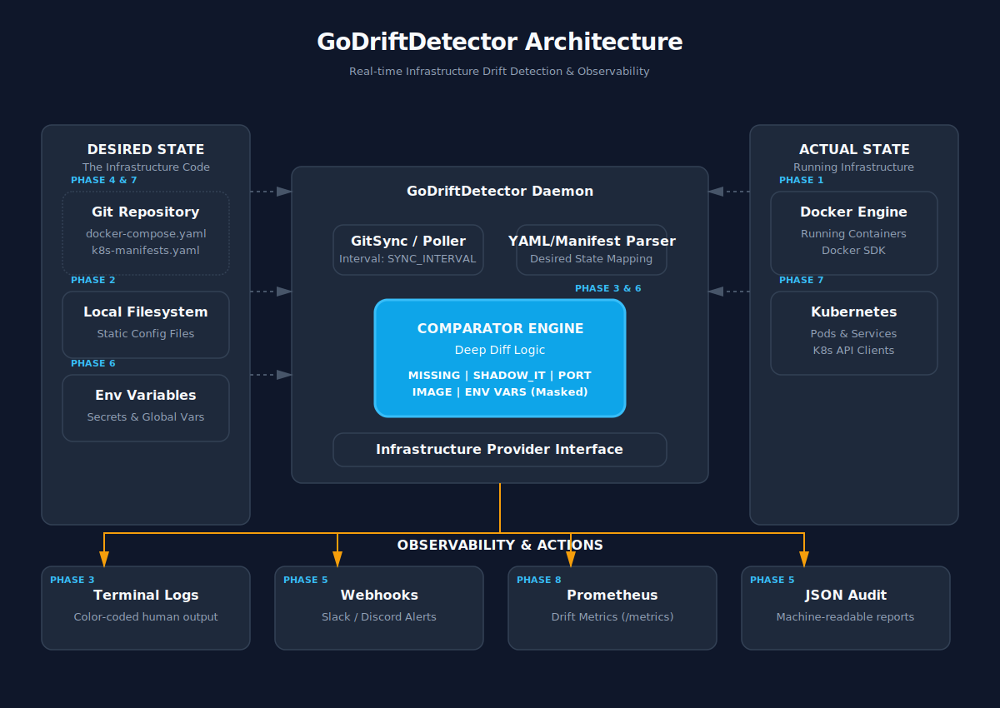

<div align="center">
  <h1>GoDriftDetector</h1>
  <p>Agente de detecção de drift para infraestruturas Docker baseadas em Compose.</p>

  

  <br>


[](https://goreportcard.com/report/github.com/esousa97/godriftdetector)
[](https://pkg.go.dev/github.com/esousa97/godriftdetector)


</div>

---

godriftdetector é um daemon leve que compara continuamente o estado declarado (Desired State) da sua infraestrutura em um arquivo `docker-compose.yaml` com o estado real (Actual State) dos containers rodando no Docker. Projetado para detectar "Shadow IT", downtime de serviços e divergências de versão/porta, emitindo alertas estruturados para rápida mitigação.

## Demonstração

Ao detectar um drift na infraestrutura, o agente reporta visualmente no terminal e pode notificar via Webhook:

```text
--- Ciclo de verificação: 2026-04-14T10:00:00Z ---
Lendo configuração em: ./config-repo/docker-compose.yaml
DRIFT DETECTADO!
[SHADOW_IT] Container não declarado rodando: 1a2b3c4d5e6f (Imagem: redis:alpine)
[MISSING] Serviço 'db' (imagem postgres:15) não está rodando.
[PORT_MISMATCH] Porta desejada '80:80' não encontrada no container.
Alerta enviado com sucesso para o webhook.
```

## Stack Tecnológico

| Tecnologia | Papel |
|---|---|
| **Go** | Linguagem principal para performance e binários estáticos. |
| **Docker SDK** | Extração do estado real (runtime) dos containers. |
| **go-git** | Sincronização remota do estado desejado via repositórios Git. |
| **yaml.v3** | Parsing robusto de arquivos `docker-compose.yaml`. |
| **lipgloss** | Estilização visual (cores, negrito) das saídas de terminal. |

## Pré-requisitos

- Go >= 1.25.0
- Docker em execução no host
- (Opcional) Acesso a repositórios remotos Git
- (Opcional) Webhooks configurados no Slack/Discord

## Instalação e Uso

### Como binário

```bash
go install github.com/esousa97/godriftdetector/cmd/godriftdetector@latest
godriftdetector
```

### A partir do source

```bash
git clone https://github.com/esousa97/godriftdetector.git
cd godriftdetector
go build -o godriftdetector ./cmd/godriftdetector
./godriftdetector
```

### Uso: Auditoria e Relatório em JSON

Útil para integrar a esteiras de CI/CD ou coletar snapshots de segurança:

```bash
godriftdetector --json
```

## Configuração

O comportamento do daemon é customizado por variáveis de ambiente:

| Variável | Tipo | Padrão | Descrição |
|---|---|---|---|
| `GIT_REPO_URL` | String | `""` | URL HTTPS/SSH do repositório contendo o `docker-compose.yaml`. |
| `GIT_USERNAME` | String | `""` | Usuário/Token para acesso HTTPS ao Git remoto. |
| `GIT_PASSWORD` | String | `""` | Senha/Token para acesso HTTPS ao Git remoto. |
| `LOCAL_CONFIG_DIR` | String | `"./config-repo"` | Diretório de clone/cache local do repositório Git. |
| `SYNC_INTERVAL` | Duration | `"5m"` | Frequência do loop de verificação (ex: `10m`, `30s`). |
| `WEBHOOK_URL` | String | `""` | URL para envio de alertas formatados para Slack/Discord. |

## Arquitetura

O projeto adota uma arquitetura limpa com responsabilidades bem isoladas:

<div align="center">
  
</div>

- `cmd/godriftdetector/`: Ponto de entrada do daemon e interface de linha de comando.
- `internal/domain/`: Regras de negócio, contendo o `Comparator` e os modelos (`Drift`, `DesiredState`, `InfrastructureState`).
- `internal/infra/`: Adaptadores externos, incluindo o cliente Docker (`DockerProvider`), Git (`GitProvider`), leitor de Compose (`ComposeReader`) e notificações (`WebhookNotifier`).

## Roadmap

- [x] Detecção de containers ausentes (Downtime).
- [x] Detecção de containers não declarados (Shadow IT).
- [x] Sincronização remota (Git Provider).
- [x] Alertas e integrações (Webhooks Slack/Discord).
- [x] Exportação de relatório em JSON.
- [x] Detecção de *drift* de variáveis de ambiente do container.
- [x] Suporte a Kubernetes (K8s API Provider).
- [ ] Métricas Prometheus para observabilidade.

## Contribuindo

Veja o [CONTRIBUTING.md](./CONTRIBUTING.md) para detalhes de como rodar testes, lint e abrir PRs.

## Licença

[MIT License](./LICENSE)

<div align="center">

## Autor

**Enoque Sousa**

[](https://www.linkedin.com/in/enoque-sousa-bb89aa168/)
[](https://github.com/esousa97)
[](https://enoquesousa.vercel.app)

**[⬆ Voltar ao Topo](#godriftdetector)**

Feito com ❤️ por [Enoque Sousa](https://github.com/esousa97)

**Status do Projeto:** Concluído — Pronto para uso

</div>
om/esousa97)
[](https://enoquesousa.vercel.app)

**[⬆ Voltar ao Topo](#godriftdetector)**

Feito com ❤️ por [Enoque Sousa](https://github.com/esousa97)

**Status do Projeto:** Concluído — Pronto para uso

</div>
